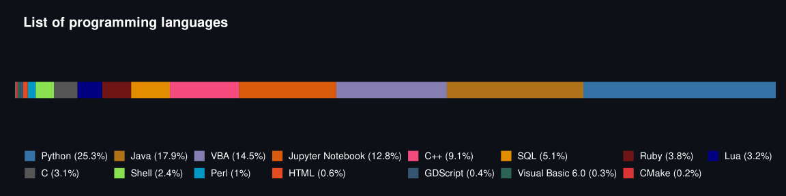

# GitHub Language Statistics in R

This R script collects programming language usage statistics for a given GitHub account via the GitHub API and generates a visual summary showing the overall share of each language across all repositories.



## Features

- Retrieves data from any GitHub account.
- Aggregates programming language usage across all repositories.
- Generates an SVG chart showing the percentage share of each language.
- Supports optional GitHub Personal Access Token (PAT) for authenticated requests.

## Workflow

Run the script from the command line and follow the prompts.

```Bash
$ Rscript github_lang_stats.R 
Enter username: githubusername 
Do you want to enter optional Github token [No/Yes]: yes 
Enter Github token: github_pat_8dsh1bfo1u4hklfjslfjabfa1...
Done!
```

## Requirements

This script requires the following **R** packages:

```R
library(gh)
library(jsonlite)
library(ggplot2)
```

## Note

The GitHub token (PAT) is optional and not required for one time use or for accounts with a small number of repositories, but recommended to increase API request limits for larger accounts or frequent use.